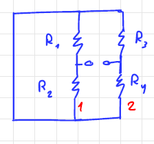

<!--Texto de Comentario-->
<!--Ctrl+Shift+P y seleccionar preview Markdown para ver resultados-->
# Título h1
## Título h2
### Título h3
#### Título h4
<!--Cambia de tamaños con el número de hastags, importante poner espacios-->
<!--Aqeí abajo, donde asteriscos puede ser "_"-->
*cursiva* **negrita** ~~tachado~~
<!--lista desordenada-->
* manzana
    * manzana2.0
* pera
* etc.
<!--lista ordenada--->
1. manzana
2. pera
    1. pera2.0
3. etc.
<!--para links-->
[Biblia.com](https://es.pornhub.com "Esto es sagrado")
>Esto es una cita
>bo
___
---
<!--para poner codigo tal cual, usar comillas hacia izq-->
`console.log('Hello World')`
<!--Para un bloque de código usar triple comilla-->
```python
print("Hello World")
```
<!--Tablas, antes de "|" tabular-->
|testo1 |texto2 |
|-------|-------|
|1      |2      |
|3      |4      |




[MasInfo](https://github.com/adam-p/markdown-here/wiki/Markdown-Here-Cheatsheet)

